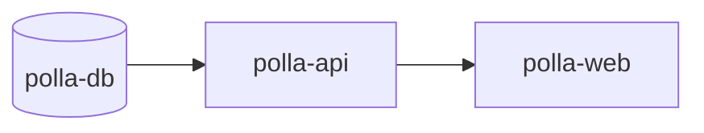

# Despliegue en Render.com

Guía para publicar la Polla Mundialista en [Render](https://render.com).

## Arquitectura en Render

| Servicio | Tipo | Directorio | URL ejemplo |
|----------|------|------------|-------------|
| `polla-db` | PostgreSQL | — | (interno) |
| `polla-api` | Web Service (Node) | `backend/` | `https://polla-api.onrender.com` |
| `polla-web` | Static Site | `frontend/` | `https://polla-web.onrender.com` |

## Opción A — Blueprint (recomendada)

1. Sube el repo a **GitHub** o **GitLab**.
2. En Render: **New → Blueprint** y conecta el repositorio.
3. Render detectará `render.yaml` y creará los 3 recursos.
4. Al desplegar, Render pedirá valores secretos. Configura:

| Variable | Servicio | Valor |
|----------|----------|-------|
| `ADMIN_PASSWORD` | polla-api | `aragon2026` (o la que prefieras) |
| `CORS_ORIGIN` | polla-api | URL del frontend, ej. `https://polla-web.onrender.com` |
| `VITE_API_URL` | polla-web | URL del API + `/api`, ej. `https://polla-api.onrender.com/api` |
| `VITE_WS_URL` | polla-web | URL WebSocket, ej. `wss://polla-api.onrender.com/ws` |

5. Tras el primer deploy del API, copia su URL pública y complétala en las variables del frontend.
6. En **polla-web → Manual Deploy → Clear build cache & deploy** para reconstruir con las URLs correctas.

> `DATABASE_URL` se inyecta automáticamente desde la base de datos `polla-db`.

## Opción B — Configuración manual

### 1. PostgreSQL

- **New → PostgreSQL**
- Name: `polla-db`
- Database: `polla_mundialista`
- Plan: Free
- Copia **Internal Database URL** (o External si pruebas desde fuera).

### 2. Backend (`polla-api`)

- **New → Web Service** → conecta el repo.
- **Root Directory:** `backend`
- **Runtime:** Node
- **Build Command:** `npm install`
- **Pre-Deploy Command:** `npm run db:init`
- **Start Command:** `npm start`
- **Health Check Path:** `/api/health`

**Environment:**

```env
NODE_VERSION=20
DATABASE_URL=<Internal Database URL de polla-db>
ADMIN_PASSWORD=aragon2026
CORS_ORIGIN=https://polla-web.onrender.com
```

Render asigna `PORT` automáticamente; no hace falta definirlo.

### 3. Frontend (`polla-web`)

- **New → Static Site** → mismo repo.
- **Root Directory:** `frontend`
- **Build Command:** `npm install && npm run build`
- **Publish Directory:** `dist`

**Environment (build time — obligatorio antes del build):**

```env
NODE_VERSION=20
VITE_API_URL=https://polla-api.onrender.com/api
VITE_WS_URL=wss://polla-api.onrender.com/ws
```

> Las variables `VITE_*` se embeben en el build. Si cambias la URL del API, hay que **volver a desplegar** el frontend.

## Orden de despliegue



1. Crear PostgreSQL.
2. Desplegar API (ejecuta `db:init` en pre-deploy).
3. Anotar URL del API.
4. Configurar `VITE_API_URL` y `VITE_WS_URL` en el frontend.
5. Configurar `CORS_ORIGIN` en el API con la URL del frontend.
6. Desplegar frontend.

## Verificación

| Check | URL / acción |
|-------|----------------|
| API viva | `GET https://polla-api.onrender.com/api/health` → `{"status":"ok"}` |
| SPA | Abrir `https://polla-web.onrender.com` |
| Admin | Login → pestaña Admin → contraseña configurada en `ADMIN_PASSWORD` |
| Chat WS | Enviar mensaje entre dos participantes |

## Plan Free — consideraciones

- El API entra en **sleep** tras ~15 min sin tráfico; el primer request puede tardar ~30–60 s.
- WebSocket se reconecta cuando el servicio despierta.
- PostgreSQL Free expira a los 90 días (Render avisa por email); en producción conviene plan de pago.
- Sesiones del API están en **memoria**: un redeploy cierra sesiones activas (los usuarios vuelven a iniciar sesión).

## SPA routing

El archivo `frontend/public/_redirects` redirige todas las rutas a `index.html` para que React Router funcione en Render Static Sites.

## CORS múltiples orígenes

Si necesitas local + producción a la vez:

```env
CORS_ORIGIN=http://localhost:5173,https://polla-web.onrender.com
```

## Dominio propio (opcional)

1. En Render → **polla-web** → Settings → Custom Domain.
2. Añade también ese dominio en `CORS_ORIGIN` del API.
3. Rebuild del frontend si cambias URLs.

## Troubleshooting

| Problema | Solución |
|----------|----------|
| CORS error en navegador | `CORS_ORIGIN` debe coincidir exactamente con la URL del frontend (sin `/` final). |
| API 502 / timeout | Plan free dormido; espera o usa un ping externo. |
| Chat no conecta | Revisa `VITE_WS_URL` = `wss://` (no `ws://`) en HTTPS. |
| Pantallas en blanco al refrescar | Confirma que `_redirects` está en `dist/` tras el build. |
| DB connection refused | Usa **Internal Database URL** en el API (misma región). |
